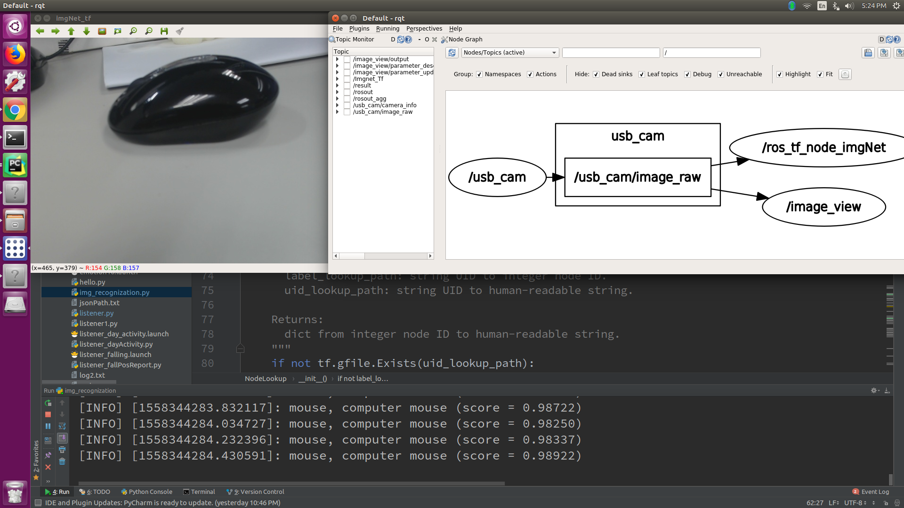
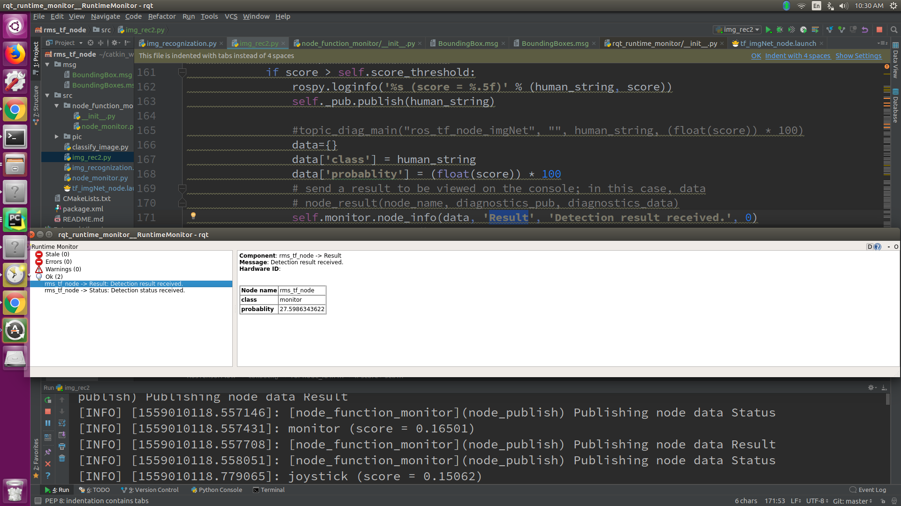

# Tensorflow Objtect recognization by image_net at ROS Nvidia Tx2
This is the tensorflow slim model for Object detection

Ret1):  Class 代號: coffee mup,kb, ms

Ret2):  Class 百分比: class confident percentage

rms_tf_node recognization ....
==============================
- Install Keras (pip install keras)
- Install TensorFlow (see [tensor flow install guide](https://www.tensorflow.org/install/install_linux))
- Install ROS (see http://wiki.ros.org)
- InstallROSTX2 (see https://github.com/jetsonhacks/installROSTX2)
    - updateRepositories.sh
    - installROS.sh
    - setupCatkinWorkspace.sh
- Install cv-bridge

```bash
$ sudo apt-get install ros-kinetic-cv-bridge ros-kinetic-opencv3
```

- (Optional1) Install camera driver (for example, cv_camera , cv_camera_node)

```bash
$ sudo apt-get install ros-kinetic-cv-camera
```
or
```bash
$ sudo apt-get install ros-kinetic-libuvc-camera
$ sudo apt-get install ros-kinetic-image-pipeline
$ rosdep update
```
or
- (Optional2) Test Camera
```bash
$ rosrun libuvc_camera camera_node
$ rosrun image_view image_view image:=image_raw
```

* install Virtualenv for Python 2.7

```shell
$ sudo apt-get install --no-install-recommends python-pip python-dev python-virtualenv virtualenv
$ virtualenv --system-site-packages /rms_root/tensorflow_py27
```

TensorFlow install note (with GPU)
-------------------------------------------
Please read official guide. This is a only note for me.

* install tensorflow-gpu for Python 2.7

```shell
$ source /rms_root/tensorflow_py27/bin/activate
$ pip install --upgrade pip
$ pip install --upgrade imutils
$ pip install --upgrade pytz
$ pip install --upgrade https://github.com/eweill/Tensorflow-Jetson-TX2/releases/download/v1.4.1/tensorflow-1.4.1-cp27-cp27mu-linux_aarch64.whl
$ or pip install --upgrade tensorflow-1.4.1-cp27-cp27mu-linux_aarch64.whl
$ deactivate
```

img_recognization.py
--------------------
* subscribe: /image  or /logitech_c922/image_raw (sensor_msgs/Image)
* publish:   /Imgnet_Tf  (sensor_msgs/Image)
* publish1:  /result (std_msgs/String)


# Environmental requirements
Opencv 3.2 or laster

Tensorflow 1.4.1


# Start up 
*git clone
```
$ cd /root/catkin_ws/ or cd /rms_root/gitlab_proj
$ git clone https://github.com/gilbert-sun/rms_tf_node.git
$ cd ros_tf_node
$ git checkout itri-devel (optional , default is no need)
$ ln -s /rms_root/gitlab_proj/ros_tf_node /rms_root/catkin_ws/src (optional , default is no need)
```
* build package
```
$ source /root/catkin_ws/devel/setup.bash or /opt/ros/kinetic/setup.bash
$ cd  /root/catkin_ws or /rms_root/catkin_ws
$ catkin_make -DCATKIN_ENABLE_TESTING=False -DCMAKE_BUILD_TYPE=Release -DCATKIN_WHITELIST_PACKAGES="rms_tf_node"

```

* test

```
$ source /rms_root/catkin_ws/devel/setup.bash
$ roscore
$ roslaunch usb_cam usb_cam-test.launch
$ rosrun rms_tf_node img_recognization.py image:=/usb_cam/image_raw
$ roslaunch rms_tf_node tf_imgNet_node.launch
```
---


# Log
```
cat result.log
```

# Function Input & Output

See img_recognization.py


```
#Program execution
python img_recognization.py image:=image_raw

#function output
(Class name,%百分比 ) == (Keyboard, 0.8253038)
```


# Demo

# Demo1

