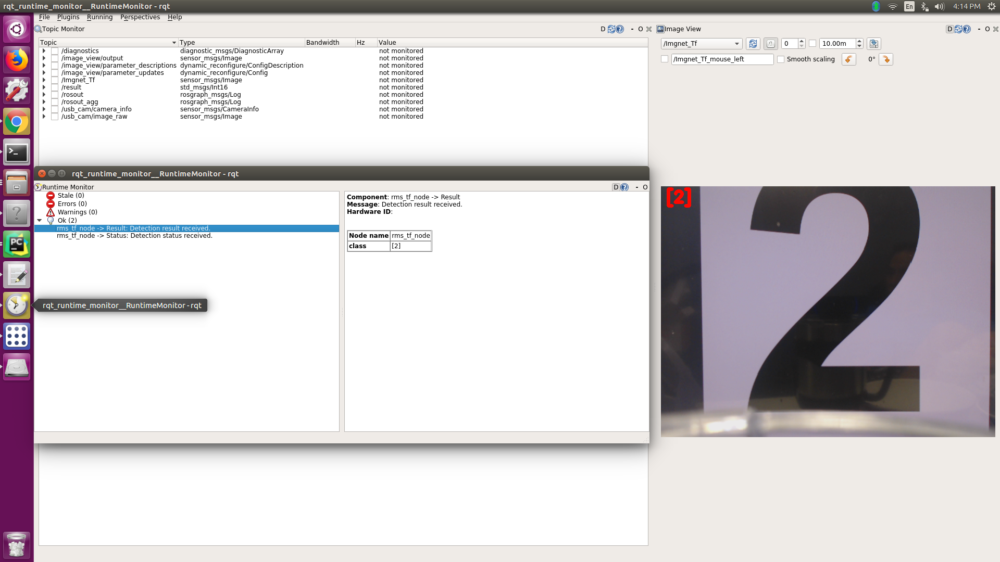

# Mnist for Tensorflow at ROS
Making a ros-node to predict numbers from camera image.  
According to Tensorflow tutorial Deep MNIST model(https://www.tensorflow.org/versions/r0.11/tutorials/mnist/pros/index.html)

Before you use this, you must install some programs.

* Install Tensorflow (see https://www.tensorflow.org/versions/r0.9/get_started/os_setup.html)  
* Install ROS (see http://wiki.ros.org)  
* Install OpenCV(see http://opencv.org/ or https://github.com/opencv/opencv)
* Install cv-bridge, and camera driver (for example, cv_camera)  

`$ sudo apt-get install ros-indigo-cv-bridge ros-indigo-cv-camera`

# tensorflow_in_ros_mnist.py
This is main file. This make the ros-node.

* publish: /result (std_msgs/Int16)
* subscribe: /image (sensor_msgs/Image)

# model.ckpt,model.ckpt.meta
This is Trained model.
Test set accuracy is approximately 99.2%.

# How to try

`$ roscore`

`$ python rms_tf_mnist.py image:=/logitech_c922/image_raw`

`$ roslaunch usb_cam usb_cam-test.launch` 

`$ rostopic echo /Imgnet_Tf`
`$ rostopic echo /result`  

# Result
You can see ros-node published predicted numbers. Look at this.  
Right picture is 9-image from camera.  
Left number is published predicted number.  

# Reference
* Deep MNIST for Experts (https://www.tensorflow.org/versions/r0.11/tutorials/mnist/pros/index.html)  
* Variables: Creation, Initialization, Saving, and Loading (https://www.tensorflow.org/versions/r0.11/how_tos/variables/index.html)  
* rostensorflow (https://github.com/OTL/rostensorflow)

